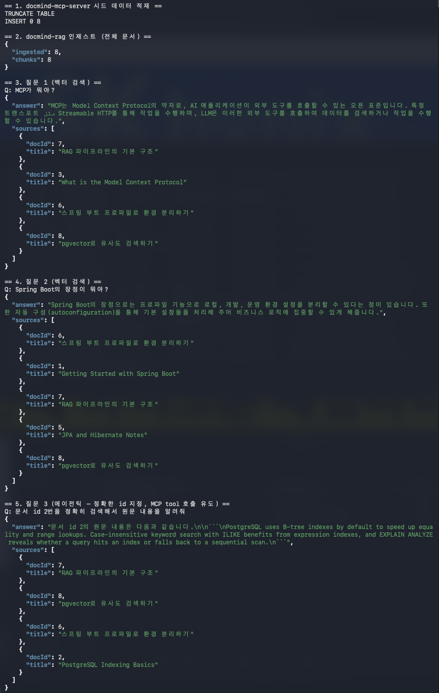
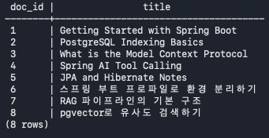
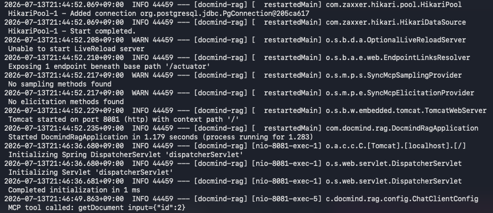

# docmind-rag


Spring AI 기반 Agentic RAG 서비스. `docmind-mcp-server`(별도 저장소)에서 문서를 가져와
pgvector에 인덱싱하고, 근거 기반으로 답변한다. 벡터 검색만으로 부족하면 MCP tool로 원본
문서를 직접 조회하는 에이전틱 폴백을 갖췄고, 로컬(Ollama)/유료(OpenAI) 하이브리드 모델
전략을 쓴다.

## 목차
1. [주요 기능](#주요-기능)
2. [아키텍처](#아키텍처)
3. [하이브리드 모델 전략](#하이브리드-모델-전략)
4. [기술 스택](#기술-스택)
5. [설치 및 실행](#설치-및-실행)
6. [API](#api)
7. [데모 시나리오](#데모-시나리오)
8. [명령어](#명령어)

## 주요 기능
- `docmind-mcp-server`에서 문서를 가져와 청크 분할 + 임베딩 + pgvector 저장 (재인제스트해도
  중복 없음 — docId 기준으로 기존 청크 삭제 후 재저장)
- RAG 챗: `QuestionAnswerAdvisor`로 top-K 유사도 검색 후 근거 기반 답변, 질문과 같은 언어로
  응답
- 에이전틱 MCP tool 폴백: 벡터 검색 컨텍스트가 부족하거나 정확한 keyword/id 조회가 필요하면
  LLM이 `searchDocuments`/`getDocument`를 직접 호출
- 로컬/유료 하이브리드 모델: 기본은 완전 무료(Ollama), `openai` 프로필로 데모 품질 전환

## 아키텍처
```
User ──HTTP──▶ docmind-rag (:8081)
                ├─ ChatClient
                │    ├─ QuestionAnswerAdvisor ──▶ pgvector (:5433, docmind_rag)
                │    ├─ chat model: Ollama qwen2.5:7b (local) | OpenAI gpt-4o-mini (openai)
                │    └─ MCP tools (searchDocuments/getDocument, agentic fallback)
                │                     │ Streamable HTTP
                └─ Ingestion pipeline ┴──▶ docmind-mcp-server (:8080) ──▶ PostgreSQL (:5432)
                     listDocuments/getDocument → chunk → embed → pgvector
```
`docmind-mcp-server`가 원본 문서의 source of truth이고, `docmind-rag`는 그 문서로 만든
의미 검색 인덱스(청크 + 임베딩)만 소유한다.

## 하이브리드 모델 전략
| 구분 | local 프로필 (기본) | openai 프로필 (데모) |
|------|---------------------|----------------------|
| Chat | Ollama `qwen2.5:7b` | OpenAI `gpt-4o-mini` |
| Embedding | Ollama `nomic-embed-text` (768차원) | Ollama `nomic-embed-text` (768차원) |

임베딩은 모든 프로필에서 Ollama로 고정. 임베딩 모델을 바꾸면 벡터 차원이 달라져(768 vs
1536) pgvector에 저장된 데이터가 전부 무효화되기 때문 — 하나의 임베딩 모델만 쓰면 벡터
테이블도 하나로 유지되고, 프로필을 바꿔도 재인제스트가 필요 없고 임베딩 비용도 들지 않는다.
대신 `openai` 프로필로 데모를 돌릴 때도 Ollama는 계속 떠 있어야 한다. 어떤 모델을 쓸지는
코드가 아니라 `spring.ai.model.chat`/`spring.ai.model.embedding` 프로퍼티가 결정한다.

## 기술 스택
- Java 21, Spring Boot 3.5.16, Gradle (Groovy)
- Spring AI 1.1.8 — pgvector VectorStore, MCP client (Streamable HTTP), Ollama + OpenAI
  starter, `QuestionAnswerAdvisor`
- PostgreSQL + pgvector (Docker, 5433번 포트)
- Lombok, Actuator (health check)

## 설치 및 실행

사전 요구사항: JDK 21, Docker, Ollama, 그리고 실행 중인 `docmind-mcp-server`(별도 저장소,
:8080 — 인제스트 단계에서 문서를 가져오는 대상).

1. 환경변수 템플릿 복사:
   ```bash
   cp .env.example .env
   ```
2. pgvector 실행:
   ```bash
   docker compose up -d
   ```
3. 임베딩/로컬 챗 모델 pull (최초 1회, 모든 프로필에 필요):
   ```bash
   ollama pull nomic-embed-text
   ollama pull qwen2.5:7b
   ```
4. 서버 실행 (local 프로필, 기본값):
   ```bash
   ./gradlew bootRun
   ```

`openai` 프로필로 데모 품질 응답을 쓰려면 (embedding은 여전히 Ollama이므로 Ollama도 계속
떠 있어야 함):
```bash
SPRING_PROFILES_ACTIVE=openai OPENAI_API_KEY=... ./gradlew bootRun
```

서버 포트: 8081.

## API
| Endpoint | 설명 |
|----------|------|
| `POST /api/ingest` | `{"documentId": 3}` (생략 시 전체 문서) — mcp-server에서 문서를 가져와 청크 분할·임베딩·저장. 재인제스트해도 중복되지 않음 |
| `POST /api/chat` | `{"question": "...", "topK": 5}` (topK 생략 시 5, 최대 10) — 근거 기반 답변 + 출처(docId/title) 목록 반환 |

에러는 `{"error": "message"}` 형태의 구조화된 JSON으로 반환된다. 전체 스펙은
`docs/PLANNING.md` 참고.

## 데모 시나리오
`scripts/demo.sh`가 전체 파이프라인을 한 번에 보여준다: `docmind-mcp-server`에 시드 문서
5개 적재 → `docmind-rag`에 전체 인제스트 → 질문 3개(벡터 검색 2개 + 에이전틱 MCP tool 호출
1개).
```bash
./scripts/demo.sh
```



**1~2단계 — 시드 + 인제스트**
```
== 1. docmind-mcp-server 시드 데이터 적재 ==
TRUNCATE TABLE
INSERT 0 5

== 2. docmind-rag 인제스트 (전체 문서) ==
{
  "ingested": 5,
  "chunks": 5
}
```

인제스트 후 pgvector에 청크가 실제로 저장된 것을 확인할 수 있다:
```bash
docker compose exec postgres psql -U docmind -d docmind_rag \
  -c "SELECT metadata->>'docId' AS doc_id, metadata->>'title' AS title FROM vector_store;"
```



**질문 1, 2 — 벡터 검색 (`QuestionAnswerAdvisor`)**

아래는 로컬 모델(`qwen2.5:7b`)로 실제 실행한 무편집 결과다. 소형 모델 특성상 표현이 다소
어색하거나 답변 언어가 간헐적으로 흔들릴 수 있다.
```
== 3. 질문 1 (벡터 검색) ==
Q: MCP가 뭐야?
{
  "answer": "MCP는 Model Context Protocol의 약자로, AI 응용 프로그램이 Streamable HTTP 같은 전송을 통해 외부 도구를 호출할 수 있는 오픈 표준입니다. 이 프로토콜은 러닝 마chine(LLM)이 테이퍼드 매개변수와 함께 도구를 실행하여 데이터를 가져오거나 행동을 취할 수 있게 합니다.",
  "sources": [
    {
      "docId": 3,
      "title": "What is the Model Context Protocol"
    }
  ]
}
```
```
== 4. 질문 2 (벡터 검색) ==
Q: Spring Boot의 장점이 뭐야?
{
  "answer": "Spring Boot의 주요 장점은 다음과 같습니다:\n\n1. **자동 구성(Autoconfiguration)**: Spring Boot는 기본 설정을 처리하는 데 필요한 많은 번거로운 설정을 자동으로 수행합니다. 이로 인해 개발자가 비즈니스 로직에 더 집중할 수 있습니다.\n\n2. **독립 실행 가능한 애플리케이션**: Spring Boot를 사용하면 스프링 기반의 생산성을 높일 수 있는 독립 실행 가능한 애플리케이션을 쉽게 만들 수 있습니다.\n\n3. **JPA와 Hibernate**: JPA를 통해 Java 엔티티를 관계형 테이블과 매핑하고, 기본 제공으로 Hibernate를 사용할 수 있습니다.\n\n4. **트랜잭션 처리**: `@Transactional` 어노테이션을 사용하여 데이터베이스 작업을 원자적으로 유지하며, 이를 통해 트랜잭션 관리를 간편하게 할 수 있습니다.\n\n5. **레포지토리 abstraction**: 엔티티를 로드하고 저장하는 데 필요한 번거로운 코드를 감추는 데 도움이 됩니다.\n\n6. **Spring AI**: annotated 메서드를 LLM 호출 가능한 도구로 변환하여, 이러한 도구들을 프레임워크가 자동으로 관리하고 호출합니다.\n\n위의 내용은 Spring Boot의 주요 장점을 요약한 것입니다.",
  "sources": [
    {
      "docId": 1,
      "title": "Getting Started with Spring Boot"
    },
    {
      "docId": 5,
      "title": "JPA and Hibernate Notes"
    },
    {
      "docId": 4,
      "title": "Spring AI Tool Calling"
    }
  ]
}
```

**질문 3 — 에이전틱 (MCP tool 호출)**

정확한 문서 id를 지정하면 벡터 검색 대신 `getDocument` MCP tool을 직접 호출해 원문을
가져온다. 서버 로그에서 실제 호출을 확인할 수 있다:


```
== 5. 질문 3 (에이전틱 — 정확한 id 지정, MCP tool 호출 유도) ==
Q: 문서 id 2번을 정확히 검색해서 원문 내용을 알려줘
{
  "answer": "문서의 원문 내용은 다음과 같습니다.\n\nPostgreSQL uses B-tree indexes by default to speed up equality and range lookups. Case-insensitive keyword search with ILIKE benefits from expression indexes, and EXPLAIN ANALYZE reveals whether a query hits an index or falls back to a sequential scan.",
  "sources": [
    {
      "docId": 2,
      "title": "PostgreSQL Indexing Basics"
    }
  ]
}
```

## 명령어
```bash
./gradlew bootRun    # 서버 실행 (local 프로필)
./gradlew test        # 테스트
./gradlew build       # 전체 빌드
./scripts/demo.sh     # 데모 시나리오 실행
```
